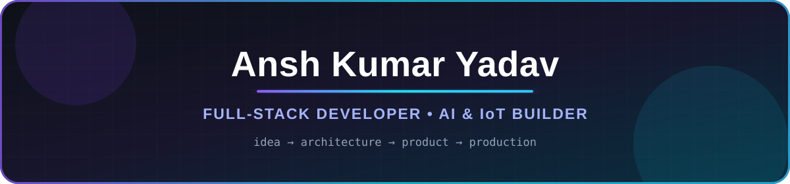

<p align="center">
  
</p>

<p align="center">
  <a href="https://readme-typing-svg.demolab.com">
    
  </a>
</p>

<p align="center">
  <a href="https://anshkumar6400.xyz"></a>
  <a href="https://www.linkedin.com/in/anshkumar6500/"></a>
  <a href="mailto:anshkumar6400@gmail.com"></a>
  <a href="https://leetcode.com/u/anshkumar6400/"></a>
</p>

## Hey, I'm Ansh 

I'm a full-stack developer and 2026 graduate based in Hyderabad, India. I enjoy turning ambitious ideas into dependable software—from backend APIs and realtime data pipelines to polished interfaces and self-managed deployments.

My work sits at the intersection of **product engineering, AI, IoT, and developer tooling**. I care about useful abstractions, clean interfaces, reliable infrastructure, and shipping systems that hold up outside a demo.

> **A note on my GitHub:** most of my professional and production work lives in private repositories. What you see here is only the surface—a public glimpse of a much larger body of work.

## What I build

- **Full-stack products** — responsive web apps, dashboards, admin systems, and business workflows
- **Realtime systems** — event-driven interfaces, telemetry, messaging, analytics, and alerting
- **AI-powered tools** — practical automation, data processing, feedback analysis, and intelligent workflows
- **Connected experiences** — software that works with IoT devices, BLE, MQTT, and live operational data
- **Production infrastructure** — containerized services, databases, reverse proxies, object storage, and VPS deployments

## Tech I work with

<p align="center">
  
</p>

<p align="center">
  
</p>

<p align="center">
  
  
  
  
  
</p>

## How I approach engineering

```text
Understand the real problem
        ↓
Design the simplest dependable system
        ↓
Build across the stack
        ↓
Measure, refine, and ship
```

I like owning the full journey: shaping the architecture, building the experience, connecting the data, and getting it running reliably in production.

## Public GitHub snapshot

<p align="center">
  
</p>

<p align="center">
  
  
</p>

<p align="center">
  
</p>

<p align="center">
  <sub>These cards reflect the public slice of my work; most active development is private.</sub>
</p>

## Let's build something useful

I'm open to conversations about software engineering, full-stack development, AI-enabled products, IoT systems, and interesting technical problems.

<p align="center">
  <a href="https://anshkumar6400.xyz"><strong>Explore my portfolio →</strong></a>
  &nbsp;&nbsp;•&nbsp;&nbsp;
  <a href="https://github.com/AnshKumar6400"><strong>Browse the public surface →</strong></a>
</p>

<p align="center">
  
</p>

